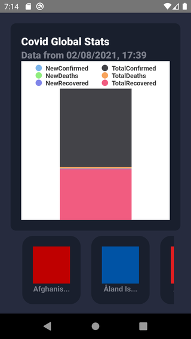
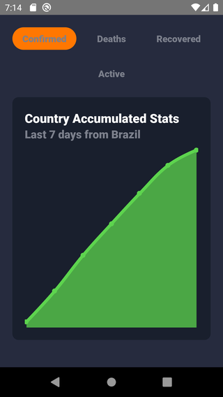

# Covid 19 Info

## About this Project

_"The objective of the project is to help people to access and visualize some SARS COV2 data obtained from [https://api.covid19api.com/](https://api.covid19api.com/)"._

## Why?

This project is part of my personal portfolio, so, I'll be happy if you could provide me any feedback about the project, code, structure or anything that you can report that could make me a better developer!

Email-me: harrisonhenrisn@gmail.com

Connect with me at [LinkedIn](https://linkedin.com/in/harrison-henri-dos-santos-nascimento).

Also, you can use this Project as you wish, be for study, be for make improvements or earn money with it!

It's free!

## Functionalities

- Home screen



- Country Stats screen



## Install

Clone the repo using

```
$ git clone https://github.com/HarrisonHenri/covid19info
```

```
$ cd covid19info
```

Install all the required dependencies

```
$ yarn
```

Then execute

```
$ yarn start
```

## Built With

- [React](https://github.com/facebook/react) - Build the web app using JavaScript and React
- [React-navigation](https://github.com/react-navigation/react-navigation) - Routing and navigation for your React Native apps
- [React-native](https://github.com/expo/react-native) - Build the native app using JavaScript and React
- [Axios](https://github.com/axios/axios) - HTTP Client
- [Luxon](https://github.com/moment/luxon) - Datetime formatter
- [Highcharts](https://github.com/highcharts/highcharts-react-native)

## Contributing

You can send how many PR's do you want, I'll be glad to analyse and accept them! And if you have any question about the project...

Email-me: harrisonhenrisn@gmail.com

Connect with me at [LinkedIn](https://linkedin.com/in/harrison-henri-dos-santos-nascimento-a6ba33112).

Thank you!